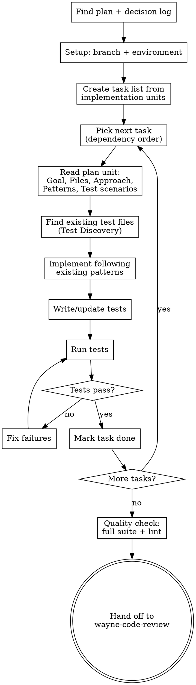
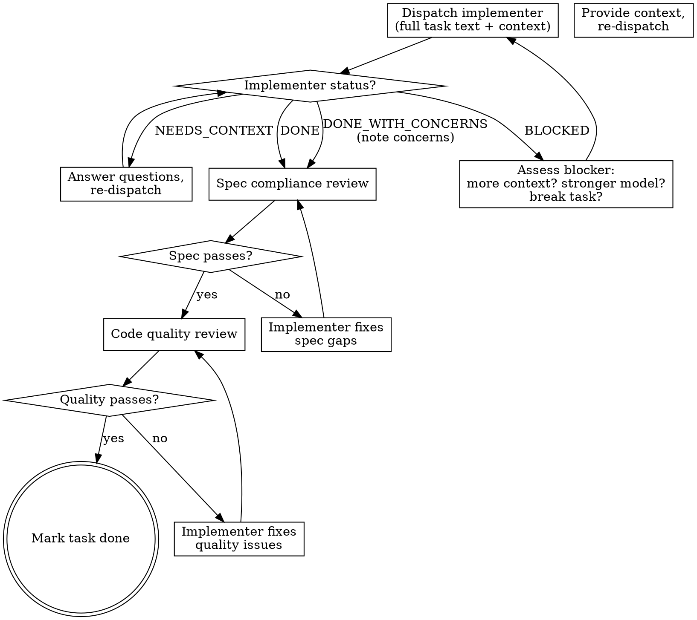

# Wayne Work

Execute a plan systematically. Ship complete features, not 80% progress.

This skill takes a plan from `wayne-plan` (or a bare prompt) and builds it
task by task, testing as it goes. It does NOT commit or create PRs — that's
`wayne-ship`'s job after `wayne-code-review` passes.

## Language Rules

**Chinese (output to user):** ALL communication shown to the user — questions, explanations,
progress updates, status reports, blocker announcements. This includes AskUserQuestion
text and any prose the user reads.

**English (written to files):** ALL files saved to disk — source code, tests, configs,
code comments, task updates. No exceptions.

**English (structural labels):** Task names, phase headers, status markers stay English
even in Chinese prose.

## Checklist

1. **Find the plan** — locate wayne-plan + decision log
2. **Setup environment** — branch, deps, verify tools
3. **Create task list** — derive from plan's implementation units
4. **Execute loop** — build each task, test, mark done
5. **Quality check** — full test suite, lint, pattern compliance
6. **Hand off** — to `wayne-code-review` then `wayne-ship`

## Process Flow



---

## Phase 0: Input Triage

Determine what you're working from:

| Input | Action |
|-------|--------|
| **Plan file** (`docs/plans/*.md`) | Read it, go to Phase 1 |
| **Bare prompt** ("add X to Y") | Scan affected files, assess complexity, build task list |

### Bare prompt complexity routing

| Complexity | Signals | Action |
|-----------|---------|--------|
| **Trivial** | 1-2 files, no behavioral change | Implement directly, skip task list |
| **Small/Medium** | Clear scope, <10 files | Build task list, proceed |
| **Large** | Cross-cutting, 10+ files, auth/payments | 建议先跑 `wayne-mind-explode` + `wayne-plan`。如果用户坚持直接做，那就建任务列表继续 |

---

## Phase 1: Quick Start

### 1.1 Read Plan + Decision Log

If a plan exists:
- Read it completely
- Check for `Execution note` on each implementation unit (test-first, characterization-first, etc.)
- Check `Deferred to Implementation` section — questions left for you to resolve
- Check `Scope Boundaries` — explicit non-goals, refer back if scope creep starts
- Read `Patterns to follow` for each unit before implementing

If a decision log exists (`docs/decisions/*.md`):
- Read it — understand WHY decisions were made
- Each decision constrains your implementation choices
- If you need to deviate from a logged decision, flag it to the user

**如果有不清楚的地方，现在问。做错了再返工比问一个问题贵得多。**

### 1.2 Setup Environment

```bash
current_branch=$(git branch --show-current)
default_branch=$(git symbolic-ref refs/remotes/origin/HEAD 2>/dev/null | sed 's@^refs/remotes/origin/@@')
[ -z "$default_branch" ] && default_branch=$(git rev-parse --verify origin/main >/dev/null 2>&1 && echo "main" || echo "master")
echo "BRANCH: $current_branch"
echo "DEFAULT: $default_branch"
```

If on default branch, ask user (in Chinese) whether to create a feature branch.
If on a feature branch already, confirm and continue.

### 1.3 Create Task List

Derive tasks from the plan's implementation units. For each unit, create a task with:
- Goal from the unit
- Files to create/modify/test
- Dependencies on other tasks
- Execution note (if any)
- Verification criteria from the unit

Use TaskCreate to track each one. Mark dependencies with addBlockedBy.

### 1.4 Choose Execution Strategy

**Default bias: maximize parallelism.** If tasks can run in parallel, they should.

| Strategy | When | Priority |
|----------|------|----------|
| **Agent Teams** | 3+ tasks, Agent Teams available, complex coordination needed | **Preferred** |
| **Parallel subagents** | 3+ tasks where units touch non-overlapping files | Default for independent tasks |
| **Serial subagents** | 3+ tasks with hard dependencies between them | Only when parallel isn't possible |
| **Inline** | 1-2 tasks, or bare prompt work | Smallest work only |

### 1.4.1 Dependency Analysis

Before choosing strategy, build the dependency graph from the task list:

```
For each task pair (A, B):
  - Do they touch overlapping files? → B depends on A (or vice versa)
  - Does B's input require A's output? → B depends on A
  - Are they independent? → Can run in parallel
```

Group tasks into **waves** — each wave contains tasks that can run in parallel:

```
Wave 1: [Task 1, Task 3, Task 5]  ← no dependencies between them
Wave 2: [Task 2, Task 4]          ← depend on Wave 1 outputs
Wave 3: [Task 6]                  ← depends on Wave 2
```

### 1.4.2 Agent Teams (Preferred when available)

If TeamCreate is available and there are 3+ tasks:

1. **Create team** via TeamCreate
2. **Create tasks** via TaskCreate with dependency relationships
3. **Spawn teammates** via Agent tool with `team_name` — one per parallel wave or specialized role:
   - **Implementer agents** — one per independent task or task group
   - **Tester agent** (optional) — runs tests continuously as implementers finish
4. **Coordinate** — monitor task completion, unblock dependent tasks, reassign if stuck
5. **Merge results** — after all tasks complete, verify no conflicts between parallel work
6. **Cleanup** — shutdown teammates, delete team

**Agent team dispatch prompt for each teammate:**
```
You are implementing Unit N from the plan at <plan_path>.
Decision log: <decisions_path>

Your unit:
- Goal: <goal>
- Files: <files>
- Approach: <approach>
- Patterns to follow: <patterns>
- Test scenarios: <test_scenarios>
- Verification: <verification>

Rules:
- Follow existing code patterns. Read before writing.
- Write/update tests for every behavioral change.
- Run tests after each change — fix failures immediately.
- Do NOT commit (wayne-ship handles that).
- Report when done: what was built, what tests pass, any concerns.
```

### 1.4.3 Parallel Subagents (Fallback)

If Agent Teams unavailable, dispatch independent tasks as parallel subagents:

- Launch all independent tasks in a **single message** with multiple Agent tool calls
- After Wave 1 completes, launch Wave 2, etc.
- Give each agent the same context as Agent Teams (plan, unit, decision log)

### 1.4.4 Conflict Resolution After Parallel Work

After parallel agents complete (whether Agent Teams or parallel subagents):

1. **Check for merge conflicts** — did agents edit overlapping code?
2. **Run full test suite** — parallel changes may break each other
3. **Review integration points** — where parallel units interact, verify they connect correctly
4. If conflicts or failures: fix them before proceeding to the next wave

---

## Phase 2: Execute

### 2.0 Extract All Task Context Upfront

**Before dispatching any subagent**, the controller (you) extracts FULL text for every task
from the plan. Subagents never read the plan file — you provide everything they need.

For each task, prepare:
- Full task text from plan (Goal, Files, Approach, Patterns, Test scenarios, Verification)
- Decision log entries relevant to this task
- Scene-setting context (where this fits in the overall design, dependencies)
- Execution note (test-first, characterization-first, etc.)

### 2.1 Per-Task Execution Cycle

Each task goes through this cycle, whether inline, subagent, or agent team member:



### 2.2 Implementer Dispatch

Dispatch via Agent tool. **Provide full task text — never make subagent read the plan file.**

```
Agent(description: "Implement Task N: [name]", prompt: |
  You are implementing Task N: [name]

  ## Task Description
  [FULL TEXT of task from plan — pasted here]

  ## Context
  [Where this fits, dependencies, what was decided and why (from decision log)]

  ## Before You Begin
  If you have questions about requirements, approach, or dependencies — ask now.

  ## Your Job
  1. Implement exactly what the task specifies
  2. Write tests (follow Execution note if present)
  3. Verify implementation works — run tests
  4. Self-review: completeness, quality, YAGNI
  5. Report back

  Do NOT commit (wayne-ship handles that).

  ## Report Format
  - **Status:** DONE | DONE_WITH_CONCERNS | BLOCKED | NEEDS_CONTEXT
  - What you implemented
  - Files changed
  - Test results
  - Self-review findings
  - Any concerns
)
```

### 2.3 Implementer Status Handling

| Status | Action |
|--------|--------|
| **DONE** | Proceed to spec compliance review |
| **DONE_WITH_CONCERNS** | Read concerns. If correctness/scope issue → address first. If observation → note and proceed to review |
| **NEEDS_CONTEXT** | Provide missing context, re-dispatch same agent via SendMessage |
| **BLOCKED** | 1) Context problem → provide more context. 2) Task too hard → re-dispatch with `model: "opus"`. 3) Task too large → break into subtasks. 4) Plan is wrong → flag to user |

**Never** ignore an escalation or force retry without changes.

### 2.4 Two-Stage Per-Task Review (Main Agent)

The **main agent (you)** runs both review stages directly — no separate reviewer subagents.
This keeps the review loop tight and avoids context fragmentation.

**Stage 1: Spec Compliance** — Did they build what was requested? Nothing more, nothing less.

When implementer reports DONE:
1. Read the ACTUAL CODE they changed (do NOT trust the report)
2. Compare to the task requirements line by line
3. Check for:
   - **Missing:** requirements skipped or not implemented
   - **Extra:** features not requested (YAGNI violation)
   - **Misunderstood:** right feature, wrong interpretation
4. Verdict: ✅ Spec compliant OR ❌ Issues (list with file:line)

If ❌ → send fix instructions to implementer via SendMessage → implementer fixes →
you review again → repeat until ✅

**Stage 2: Code Quality** — Is the implementation well-built? (Only after spec passes)

1. Read the diff for this task's files
2. Check:
   - Code follows existing patterns?
   - Names clear and accurate?
   - Tests verify behavior (not just mock behavior)?
   - Each file has one clear responsibility?
   - No unnecessary complexity?
3. Verdict: ✅ Approved OR ❌ Issues (list with file:line + recommended fix)

If ❌ → send fix instructions to implementer → implementer fixes → you review again →
repeat until approved.

**Why main agent reviews:** In Agent Teams, the lead has full context — the plan,
the decision log, all prior task results. Dispatching separate reviewer subagents
would lose this context. The lead reviews faster and catches cross-task consistency
issues that isolated reviewers would miss.

### 2.5 Parallel Wave Execution

When using Agent Teams or parallel subagents, apply the per-task cycle in waves:

```
Wave 1: [Task A, Task C, Task E]  ← dispatch implementers in parallel
  → Each completes → spec review each → quality review each
  → Conflict resolution (merge check + full test suite)

Wave 2: [Task B, Task D]          ← depend on Wave 1
  → Same cycle
  → Conflict resolution

Wave 3: [Task F]                  ← depends on Wave 2
  → Same cycle
```

**Within a wave:** implementers run in parallel (independent tasks, non-overlapping files).
**Between waves:** conflict resolution before starting next wave.
**Reviews:** can run in parallel across tasks within the same wave.

### 2.6 Test Discovery

Before changing a file, find its test files:
- Search for test/spec files that import, reference, or share names with the implementation file
- When the plan specifies test scenarios, start there
- Supplement gaps from the unit's context

### 2.7 System-Wide Check

Before marking a task done:

| Question | Action |
|----------|--------|
| What fires when this runs? (callbacks, observers, hooks) | Read actual code 2 levels out |
| Do tests exercise the real chain, not just mocks? | Write at least one integration test |
| Can failure leave orphaned state? | Test the failure path |
| What other interfaces expose this? | Grep for the behavior in related classes |

Skip for leaf-node changes with no callbacks or state persistence.

### 2.8 No Commits During Build

**Do NOT run `git commit` during this phase.** Committing is `wayne-ship`'s job.

Track which files belong to which logical unit so `wayne-ship` can commit per-feature.

---

## External Delegate Mode (Optional)

For pure code implementation tasks where token conservation matters, delegate to
Codex CLI while keeping planning, review, and git operations in Claude.

### When to Use

| Delegate | Standard |
|----------|----------|
| Pure code implementation | Research or exploration needed |
| Plan has clear acceptance criteria | Ambiguous, needs iteration |
| Token conservation matters | Small task, unlimited context |
| Well-scoped file changes | Many interconnected files |

### Activation

- User says "delegate to codex" or "delegate mode"
- Plan unit has `Execution target: external-delegate` in its Execution note

### Environment Guard

Before delegating, check if already inside a sandbox:
```bash
[ -n "$CODEX_SANDBOX" ] || [ -n "$CODEX_SESSION_ID" ] && echo "INSIDE_SANDBOX" || echo "SAFE"
```
If inside sandbox: skip delegation, use standard mode.

### Workflow per Task

1. **Check:** `which codex 2>/dev/null` — if not found, use standard mode
2. **Build prompt:** Goal, Files, Approach from plan unit + project conventions. Include:
   "No git commits, no PRs. Run `git status` and `git diff --stat` when done."
3. **Write prompt to temp file** (avoid shell quoting issues)
4. **Run:** `cat /tmp/task-prompt.md | codex exec -s read-only`
5. **Review diff:** Verify non-empty and in-scope. Run tests/lint.
6. **Fall back** on any failure. After 3 consecutive failures, disable delegation.

Claude handles all git operations — Codex sandbox blocks `.git/` writes.

---

## Phase 2.9: Plan Alignment Check (Subagent)

After ALL tasks complete, before quality check, dispatch a **plan alignment subagent**
to verify the implementation matches the plan holistically — not just per-task, but
the full picture.

```
Agent(description: "Plan alignment audit", prompt: |
  You are auditing whether an implementation matches its plan.

  ## The Plan
  [Read the plan file at: <plan_path>]

  ## The Decision Log
  [Read the decision log at: <decisions_path>]

  ## Your Job

  Run `git diff origin/<base>` to see what was actually built.
  Run `git log origin/<base>..HEAD --oneline` for commit history.

  Cross-reference the diff against the plan. For EACH implementation unit in the plan:

  1. **DONE** — clear evidence in the diff that this unit was implemented. Cite files.
  2. **PARTIAL** — some work exists but incomplete.
  3. **NOT DONE** — no evidence in the diff.
  4. **CHANGED** — implemented differently than planned. Note the difference.

  Then check for scope drift:
  5. **EXTRA** — files or features in the diff that are NOT in any plan unit.

  Then check decision compliance:
  6. For each decision in the decision log, verify the implementation honors it.
     Flag any decision that was contradicted.

  Then check dead code cleanup:
  7. If the plan has a "Dead Code / Legacy Cleanup" section, verify those
     deletions/deprecations actually happened.

  ## Output Format

  PLAN ALIGNMENT AUDIT
  ═══════════════════
  Plan: <path>
  Decision log: <path>

  ## Unit Status
  [DONE]      Unit 1: ... — files: ...
  [DONE]      Unit 2: ... — files: ...
  [PARTIAL]   Unit 3: ... — missing: ...
  [NOT DONE]  Unit 4: ...
  [CHANGED]   Unit 5: ... — planned X, built Y

  ## Scope Drift
  [EXTRA] path/to/unplanned_file — not in any plan unit
  [CLEAN] no unplanned changes

  ## Decision Compliance
  [OK]        Decision #1: ...
  [VIOLATED]  Decision #3: planned X but implemented Y

  ## Dead Code Cleanup
  [DONE]      Deleted old_handler.py
  [NOT DONE]  Legacy endpoint still exists

  ─────────────────────
  COMPLETION: N/M DONE, X PARTIAL, Y NOT DONE, Z CHANGED
  DRIFT: [CLEAN / N unplanned items]
  DECISIONS: [ALL HONORED / N violations]
  VERDICT: ALIGNED / GAPS FOUND
  ─────────────────────
)
```

### Handle Alignment Results

| Verdict | Action |
|---------|--------|
| **ALIGNED** | 继续 Phase 3 质量检查 |
| **GAPS FOUND — PARTIAL/NOT DONE** | 告诉用户哪些计划项没完成，问要不要补做还是标记为 deferred |
| **GAPS FOUND — SCOPE DRIFT** | 告诉用户有未计划的改动，问要不要保留还是回退 |
| **GAPS FOUND — DECISION VIOLATED** | 这是严重问题。告诉用户哪个决策被违反了，必须修复后才能继续 |

Decision violations are **blocking** — fix before proceeding.
PARTIAL/NOT DONE and EXTRA are **user's call** — present and let them decide.

---

## Phase 3: Quality Check

Before handing off to review:

```bash
# Run full test suite (project's test command)
# Run linting (project's lint command)
```

### Verification Checklist

- [ ] All tasks marked completed
- [ ] Plan alignment audit passed (Phase 2.9)
- [ ] Tests pass — new/changed behavior has corresponding test coverage
- [ ] Linting passes
- [ ] Code follows existing patterns (read Patterns to follow from plan)
- [ ] No console errors or warnings
- [ ] If plan has `Requirements Trace`, verify each requirement is satisfied
- [ ] If any `Deferred to Implementation` questions existed, confirm they were resolved
- [ ] Scope boundaries respected — no unplanned work crept in

### Tell the user (in Chinese)

```
实现完成。所有任务已完成，测试通过，lint 通过。

接下来：
1. 运行 wayne-code-review (双声道审查)
2. 审查通过后运行 wayne-ship (提交)
3. 提交后运行 wayne-compound (记录经验)

要现在开始审查吗？
```

---

## Phase 4: Hand Off

This skill's job ends here. The next skills in the pipeline are:

1. **`wayne-code-review`** — dual-voice review gate (must pass)
2. **`wayne-ship`** — atomic commits with Jira prefix, `[why]/[how]`, `-s`
3. **`wayne-compound`** — capture lessons learned

Suggest invoking `wayne-code-review` when Phase 3 passes.

---

## Integration with Wayne Pipeline

```
wayne-mind-explode → wayne-plan → wayne-work → wayne-code-review → wayne-ship → wayne-compound
     (WHAT)            (HOW)       (BUILD)         (GATE)           (COMMIT)     (LEARN)
```

### What wayne-work reads

| Artifact | What it provides |
|----------|-----------------|
| **Decision log** | Why decisions were made — constrains implementation choices |
| **Plan** | Implementation units, files, approach, test scenarios, verification |
| **Existing code** | Patterns to follow, conventions to match |

### What wayne-work does NOT do

- **Does NOT commit** — that's `wayne-ship`
- **Does NOT review** — that's `wayne-code-review`
- **Does NOT create PRs** — that's `wayne-ship`
- **Does NOT capture learnings** — that's `wayne-compound`

---

## Logging Standard

All code produced by wayne-work MUST include proper logging. This is a non-negotiable quality gate.

### Required Levels

| Level | When |
|-------|------|
| `DEBUG` | Internal state, variable dumps, trace-level detail |
| `INFO` | Normal operation milestones (started, completed, counts) |
| `WARNING` | Recoverable issues, fallbacks, deprecation notices |
| `ERROR` | Failures that prevent expected outcome |

### Verbosity Control

- **Default (no `-v`):** show `INFO`, `WARNING`, `ERROR`. Hide `DEBUG`.
- **`-v` flag:** show all levels including `DEBUG`.

### Implementation Rules

1. **Every script entry point** must accept `-v`/`--verbose` and configure loguru level accordingly
2. **Never use bare `print()`** for operational output — use `logger.info()`. `print()` is only for stdout data output
3. **Prefer `click`** over `argparse` for CLI argument parsing
4. **Prefer `loguru`** over stdlib `logging`

### Setup Pattern

```python
import click
from loguru import logger
import sys

@click.command()
@click.option("-v", "--verbose", is_flag=True, help="Show debug logs")
def main(verbose):
    logger.remove()
    logger.add(sys.stderr, level="DEBUG" if verbose else "INFO")
    logger.info("started")
```

### Quality Check Integration

During Phase 3 quality check, verify:
- [ ] All scripts have `-v` flag support
- [ ] No bare `print()` for operational output
- [ ] Appropriate log levels used (not everything is INFO)
- [ ] `DEBUG` logs present for non-trivial logic paths
- [ ] `ERROR` logs include actionable context (what failed, why, what to do)

---

## Key Principles

- **读了再写** — read existing patterns before implementing
- **边做边测** — test after each change, not at the end
- **决策可追溯** — every implementation choice traces to a plan unit or decision log entry
- **不越界** — respect scope boundaries, don't add unplanned work
- **做完再走** — finish the feature, don't leave it 80% done
- **Chinese for discussion, English for code**
