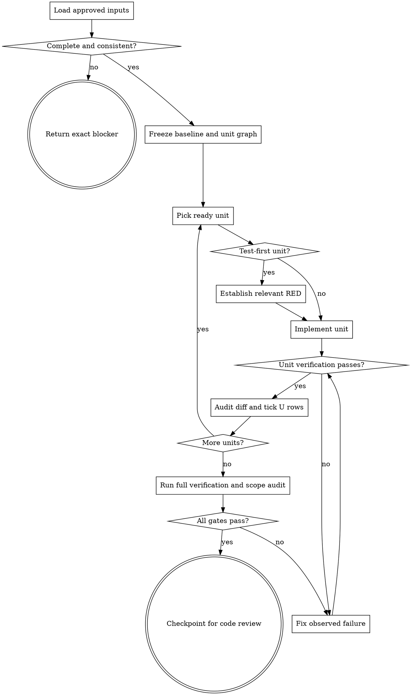

# Wayne Work

Execute one approved implementation plan to a verified, review-ready diff.

## Boundary

Own implementation, plan-unit tracking, test-as-you-go, integration, U status
updates, and the final work handoff. Do not redesign approved behavior, author a
new plan/test matrix, change E status, commit, branch, push, open a PR, run runtime
verification, invoke code review, or ship.

The plan, decision log, and test matrix are source contracts. Existing repository
instructions and unrelated dirty files remain untouched.

## Flow

## Process

### A. Load and validate inputs

Read repository instructions first, then the active plan, decision log, test
matrix, and referenced spec completely. Validate before editing:

- plan status is approved and no other active plan conflicts;
- each implementation unit has goal, dependencies, consumes/produces, files,
  approach/design, patterns, test scenarios, U/E ownership, and verification;
- every referenced U and E row exists once in the authoritative matrix;
- unit file writes fit repository and plan scope boundaries;
- no unresolved decision changes the implementation shape.

Do not invent a missing row, choose precedence between conflicting sources, or
partially implement around a protected file. Return the task's blocker contract.
When the caller requires a five-line blocker, emit exactly those five non-empty
lines with no preamble, Markdown fence, explanation outside line 5, or postscript.

### C. Freeze baseline and task graph

Capture branch, status, existing dirty paths, and the source/input manifest without
changing them. Do not create a feature branch or commit. Convert plan units into a
dependency graph and track their status with whatever task mechanism the current
runtime provides; no provider-specific task/team tool is required.

For each unit, extract its full text and relevant decisions before dispatch. A
worker must receive the unit contract directly, not rediscover or reinterpret the
whole plan. Parallelize only units whose writes do not overlap and whose inputs do
not depend on another unit's outputs. The main agent remains owner of scope, matrix
status, integration, and completion.

### D. Start one ready unit

Read the unit's real source and existing tests before writing. Confirm its expected
inputs/outputs and discover all callers or consumers named by the plan. If the
current code contradicts a plan assumption, stop and return the conflict to the
planning owner; do not silently redesign.

### R. Establish RED when required

Follow the unit execution note. For test-first work, run the exact unit command
before implementation and preserve the non-zero result. The RED must fail for the
missing behavior, not environment or tooling. An unexpected failure is a blocker
to diagnose, not permission to start coding. Never edit, delete, skip, or weaken a
locked test to manufacture GREEN.

### F. Implement the unit

Change only plan-owned files and implement the named interfaces exactly. Preserve
decision semantics, state ownership, error behavior, and existing repository
patterns. Add tests only when the plan assigns test authorship to this stage; when
tests are locked, treat them as immutable acceptance inputs.

Use the current runtime's inline, delegated, or parallel execution mechanism as
appropriate. Every implementer reports actual paths changed and commands run; no
implementer commits or updates matrix/E ownership independently.

### G. Verify and repair from evidence

Run the unit's exact verification command. If it fails, connect the failure to the
smallest source correction, apply it, and rerun the same command. Do not broaden
scope, add speculative fallback, or swap in an easier check. A provider/tool
failure is not a behavioral test result.

### H. Audit the unit and update U status

Inspect the actual diff rather than trusting a worker summary. Compare every unit
requirement and decision with code and tests; reject missing, extra, or changed
behavior. Check names, ownership, error paths, integration points, and unnecessary
complexity. Only after the real test passes, change that unit's owned U rows from
`☐` to `☑`. Never edit the U scenario text or any E row/status `⬜`.

### J. Prove integrated completion

After dependency waves finish, run the plan's full verification and lint commands.
Then audit:

- every unit is DONE with its produces consumed where planned;
- all requirements and decisions have implementation evidence;
- the diff contains only plan-owned source, authorized U status changes, and work
  state; unrelated dirty files and locked inputs are byte-identical;
- every U row is `☑`, every E row remains `⬜`;
- no TODO, partial implementation, staged file, commit, branch, or downstream
  action was introduced.

Do not call the feature complete while any command, unit, U row, decision, or scope
gate is unresolved.

### L. Handoff to wayne-code-review

Invoke `wayne-checkpoint` in return-only handoff mode. Include the plan and matrix
paths, completed units, exact passing commands, changed paths, preserved scope,
and residual risks; set the next agent to `wayne-code-review`. Tell the user tests
passed and explicitly name `wayne-code-review` as the next stage. Do not invoke it.

## Red lines

- No implementation with incomplete/conflicting source contracts.
- No provider-specific task tool, forced delegation, or fake parallelism.
- No test weakening, hidden substitute command, unchecked U row, or changed E row.
- No completion claim without full verification and actual scope-diff proof.
- No commit, branch, stage, push, review, verify, ship, or auto-advance.
