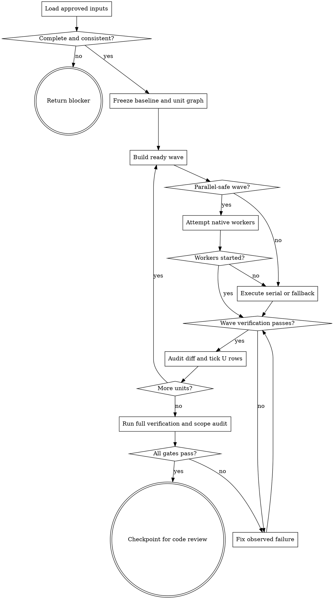

# Wayne Work

Execute one approved implementation plan to a verified, review-ready diff.

## Boundary

Own implementation, plan-unit tracking, test-as-you-go, integration, U status updates,
and the final work handoff. Do not redesign approved behavior, author a new plan/test
matrix, change E status, commit, branch, push, open a PR, verify, review, or ship.

The plan, decision log, test matrix, repository instructions, and dirty baseline are source contracts. Read `_shared/pipeline-id-contract.md`; consume IDs only from their defining structures and never renumber upstream artifacts.

## Flow

## Process

### A. Load and validate inputs

Read repository instructions first, then the active plan, decision log, test
matrix, and referenced spec completely. Validate before editing:

- plan status is approved and no other active plan conflicts;
- each implementation unit has goal, dependencies, consumes/produces, files,
  approach/design, patterns, test scenarios, U/E ownership, and verification;
- plan-owned U rows and authoritative E rows at the carried `docs/test-matrix/`
  path both exist once; the plan's E snapshot matches that matrix;
- unit file writes fit repository and plan scope boundaries;
- no unresolved decision changes the implementation shape.

Assign every `Deferred to Implementation` entry to one owning unit before dispatch.
Resolve only mechanical questions whose answer is directly observable in the
repository or runtime, and record the evidence in Work state. If an answer changes
behavior or any approved boundary, treat it as a Plan gap and follow the user/Plan
revision path below.

Do not invent a missing row, choose precedence between conflicting sources, or
partially implement around a protected file. If implementation requires a behavior,
scope, ownership, failure, compatibility, migration, or public-interface choice not
covered by the approved sources, stop and ask the user. Return the answer to Plan
for revision and re-approval; never implement it directly or choose a default.
Return the task's blocker contract.
Preserve the blocker reason, affected artifacts, owner, and user-facing explanation.
Treat any shared layout as a communication convention, not a semantic grammar. Only
an explicit caller requirement can make exact bytes or line count normative.

### C. Freeze baseline and task graph

Capture starting HEAD, branch, status, existing dirty paths, and source artifacts.
Do not create a branch or commit. Convert plan units into a dependency graph and track
status with any runtime task mechanism; no provider-specific task/team tool is required.

For each unit, extract its full text, relevant decisions, dependencies,
consumes/produces, and exact write set. Assign every path one owner. Matrix,
checkpoint, shared integration files, scope state, and full verification stay
main-owned; remove them from worker write sets.

Build dependency waves. When at least two ready units have no producer/consumer
dependency and disjoint write sets, native parallel subagents are a required
attempt, not an optional preference. Dispatch the whole wave before awaiting one
result. Count it as started only when the tool returns observable worker handles or
results. On an unavailable tool or dispatch error, explicitly fall back to serial,
then quote the exact tool error in both handoff and final result; never claim parallelism.
When a dependency or shared path prevents parallelism, record that specific edge or
path. The main agent remains owner of scope, actual-diff review, integration, and
completion.

### D. Build and start one ready wave

Read each ready unit's real source and existing tests before writing. Confirm its
inputs/outputs and named consumers. If code contradicts a plan assumption, stop and
return the conflict to planning.

Each worker receives one fixed unit ID; full goal, decisions, approach, and
consumes/produces; exact allowed paths and verification; and prohibitions on commits,
matrix/checkpoint/shared-path edits, and plan reinterpretation. Workers report actual
paths and commands; they do not rediscover the plan or update shared state. Require
one status: `DONE`, `DONE_WITH_CONCERNS`, `NEEDS_CONTEXT`, or `BLOCKED`.

- `DONE` enters verification.
- `DONE_WITH_CONCERNS` enters verification only when the concern is observational;
  correctness, scope, or ownership concerns block the unit.
- `NEEDS_CONTEXT` may receive existing repository/plan context and retry the same
  unit; it never receives a new decision invented by the main agent.
- `BLOCKED` is never retried unchanged. A source or Plan gap follows A and asks the
  user; a mechanical implementation obstacle may be decomposed without changing
  the unit's behavior or write boundary.

### R. Establish RED when required

Follow the unit execution note. For test-first work, run the exact unit command before
implementation and preserve the non-zero result. RED must fail for missing behavior,
not environment or tooling. Diagnose unexpected failures before coding. Never edit,
delete, skip, or weaken a locked test to manufacture GREEN.

### F. Implement the unit

Change only plan-owned files and implement the named interfaces exactly. Preserve
decision semantics, state ownership, error behavior, and existing repository
patterns. Add tests only when the plan assigns test authorship to this stage; when
tests are locked, treat them as immutable acceptance inputs.

Do not add adjacent cleanup, defensive behavior, fallback paths, generalized
abstractions, or compatibility work merely because they seem useful. When such a
change is necessary for correctness, the Plan is incomplete: stop and follow the
boundary process instead of expanding the unit.

Use inline execution only for a single ready unit, a dependency/shared-path serial
wave, or an explicitly recorded native-dispatch failure. Every implementer reports
actual paths changed and commands run; no implementer commits or updates
matrix/E ownership independently.

### G. Verify and repair from evidence

Run the unit's exact verification command. If it fails, connect the failure to the
smallest source correction, apply it, and rerun the same command. Do not broaden
scope, add speculative fallback, or swap in an easier check. A provider/tool
failure is not a behavioral test result.

### H. Audit the unit and update U status

After every wave, inspect the actual diff rather than trusting worker summaries.
Reject cross-owner writes or overlapping edits, compare every unit requirement and
decision with code/tests, and run the plan-defined wave/integration checks. Before
ticking any U row, dispatch one fresh read-only spec-compliance agent with the
complete decision log, spec, plan, unit, and actual diff. It must flag missing,
changed, and extra behavior or files by contextual reading; CLI output, regex,
keywords, headings, or validator status cannot substitute. Any uncovered change
fails the unit and returns to Plan/user instead of being normalized into the diff.
The main agent performs shared integration only after all producing workers finish;
do not start a dependent wave while this barrier fails. Only after each real unit
test passes, change its plan-owned U rows from `☐` to `☑`. Never edit U scenario
text, the plan's E snapshot, or any authoritative E row/status `⬜`.

### J. Prove integrated completion

After dependency waves finish, run the plan's full verification and lint commands.
Then audit:

- every unit is DONE with its produces consumed where planned;
- all requirements and decisions have implementation evidence;
- the diff contains only plan-owned source, authorized U status changes, and work
  state; starting Git status, agent write history, and final diff show no unrelated
  or locked-input mutation;
- every U row is `☑`, every E row remains `⬜`;
- no incomplete implementation, staged file, commit, branch, or downstream action
  was introduced; judge completeness from code, tests, and plan obligations rather
  than a substring scan.

Do not claim completion while any command, unit, U row, decision, or scope gate is unresolved.

### L. Handoff to wayne-code-review

Before returning success, write one packet under `.wayne/checkpoints/` through
`wayne-checkpoint` return-only mode or a supplied canonical contract. Verify the file
exists and surface its path; without either mechanism, return the exact blocker. Include
plan/matrix paths, units, passing commands, changed paths, preserved scope, residual
risks, and `next_agent: wayne-code-review`; final output repeats that literal but never invokes it.

## Red lines

- No implementation with incomplete/conflicting source contracts.
- No provider-specific task API, shell-process substitute, silent serial fallback,
  or claimed parallel success after a tool error.
- No test weakening, hidden substitute command, unchecked U row, or changed E row.
- No completion claim without full verification and actual scope-diff proof.
- No commit, branch, stage, push, review, verify, ship, or auto-advance.
