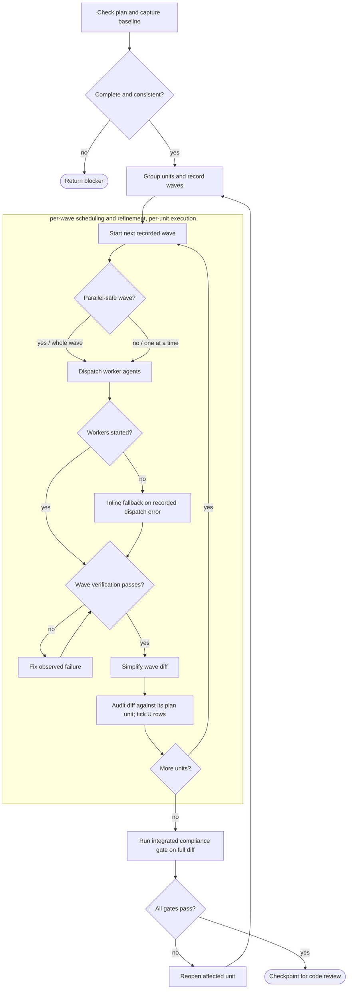

# Wayne Work

Execute one approved implementation plan to a verified, review-ready diff.

**A wave is one batch of plan units.** Finish, verify, simplify, and audit that batch before starting the next. A wave may contain one unit. The main agent groups units into waves in C; the plan does not need to supply waves.

## Boundary

Own implementation, plan-unit tracking, test-as-you-go, integration, the per-wave refinement pass, U status updates, and the final work handoff. Own three distinct scopes and never merge them: the per-unit conformance audit inside the implementation loop, the per-wave refinement over one wave's combined diff, and the single workflow-level compliance gate over the full diff. Do not redesign approved behavior, author a new plan/test matrix, change E status, commit, branch, push, open a PR, verify, ship, or perform code-quality review — that stays with `wayne-code-review`.

The plan, decision log, test matrix, repository instructions, and dirty baseline are source contracts. Read `../_shared/pipeline-id-contract.md`; consume IDs only from their defining structures and never renumber upstream artifacts.

## Flow

```mermaid
flowchart TB
    A["Check plan and capture baseline"]
    B{"Complete and consistent?"}
    X(["Return blocker"])
    C["Group units and record waves"]

    subgraph cluster_unit["per-wave scheduling and refinement, per-unit execution"]
        D["Start next recorded wave"]
        E{"Parallel-safe wave?"}
        R["Dispatch worker agents"]
        P{"Workers started?"}
        F["Inline fallback on recorded dispatch error"]
        G{"Wave verification passes?"}
        T["Fix observed failure"]
        S["Simplify wave diff"]
        H["Audit diff against its plan unit; tick U rows"]
        I{"More units?"}
    end

    J["Run integrated compliance gate on full diff"]
    K{"All gates pass?"}
    M["Reopen affected unit"]
    L(["Checkpoint for code review"])

    A --> B
    B -->|"no"| X
    B -->|"yes"| C
    C --> D
    D --> E
    E -->|"yes / whole wave"| R
    E -->|"no / one at a time"| R
    R --> P
    P -->|"yes"| G
    P -->|"no"| F
    F --> G
    G -->|"no"| T
    T --> G
    G -->|"yes"| S
    S --> H
    H --> I
    I -->|"yes"| D
    I -->|"no"| J
    J --> K
    K -->|"no"| M
    M --> C
    K -->|"yes"| L
```

## Process

Every step is labeled with its scope, and the whole-workflow gate is never collapsed into the loop. A `[per-unit]` step reads one unit's contract and diff. A `[per-wave]` step handles one recorded batch of units. A `[whole-workflow]` step handles the run's complete inputs or full diff; repeat it only where the Flow requires. A per-unit or per-wave check never replaces the whole-workflow gate, and the whole-workflow gate never runs inside the unit loop.

| Scope | Steps | Runs | Reads | Compliance agent |
| --- | --- | --- | --- | --- |
| `[whole-workflow]` setup | A | once | all source contracts and starting baseline | no |
| `[whole-workflow]` wave grouping | C | before execution; again if a unit reopens | unit contracts, dependencies, write sets, current task state | no |
| `[per-wave]` start | D | once per wave, before dispatch | recorded unit IDs, unit contracts, starting diff baseline | no |
| `[per-unit]` loop | R, F, G, H | once per unit | that unit's contract, its own diff, its verification command | no |
| `[per-wave]` refinement | S | once per wave | the wave's combined diff, the plan's allowed paths and verification command | no |
| `[whole-workflow]` gate | J, L | once per full diff | complete spec, decision log, plan, all units, full diff | yes — one fresh read-only agent |

### A. [whole-workflow] Check the plan before starting

Read the repository instructions, approved plan, decision log, test matrix, and referenced spec completely. Do not start implementation until all of these are true:

- the plan is approved and no other active plan conflicts;
- every unit specifies its goal, dependencies, consumes/produces, files, approach/design, patterns, test scenarios, U/E ownership, and verification;
- all required U rows exist exactly once in the plan, all required E rows exist exactly once in the carried test matrix, and the plan's E snapshot matches that matrix;
- every planned file change is within the repository's and plan's allowed scope;
- no unresolved decision could change the implementation.

Assign each `Deferred to Implementation` item to one unit. Work may answer only mechanical questions directly observable in the repository or runtime; record the evidence in Work state.

If a missing answer changes behavior, scope, ownership, failure handling, compatibility, migration, or a public interface, stop and ask the user. Return the answer to Plan for revision and re-approval before implementing it. Do not invent missing rows, choose between conflicting sources, choose a default, or partially implement around a protected file.

When blocked, return the task's blocker contract with the reason, affected artifacts, owner, and user-facing explanation. Shared layouts are communication examples, not a required grammar; exact bytes or line counts matter only when the caller explicitly requires them.

Once these checks pass, capture starting HEAD, branch, status, existing dirty paths, and source artifacts. Keep this run baseline unchanged. Do not create a branch or commit.

### C. [whole-workflow] Group units into waves

The main agent must write the wave list before any implementation starts:

1. Use each unit's full contract, relevant decisions, dependencies, consumes/produces, and exact write set to build the unit dependency graph. Track status in the existing Work task state; no provider-specific task tool is required.
2. Assign each path one owner. Keep the matrix, checkpoint, shared integration files, scope state, and full verification main-owned; remove them from worker write sets.
3. Group unfinished units by dependency. A unit belongs after the waves that produce its inputs. Put independent ready units together; D decides whether their write sets allow parallel execution.
4. Record each wave and its unit IDs in the same Work task state, then show the list to the user. Every unfinished unit must appear in a wave before proceeding to D.

For example, if I1 and I2 are independent and I3 needs both, record `Wave 1: I1, I2` and `Wave 2: I3`. If the plan has only I1, record `Wave 1: I1`. Do this even when the plan never mentions waves.

If J reopens a unit, keep the completed work and existing records, then group the unfinished units into new waves here. Do not reset the run baseline or dispatch a worker from C.

### D. [per-wave] Execute the next recorded wave

In D, the main agent prepares and dispatches one worker agent per unit.

Take the next wave whose dependencies have passed H. Announce its unit IDs and record its starting worktree diff in Work state before dispatch. No wave record means no dispatch; never start units first and label them as a wave afterwards.

Read each member unit's real source and existing tests. Confirm its inputs/outputs and named consumers. If code contradicts a plan assumption, stop and return the conflict to planning.

Build each worker's packet from exactly what H will audit: one fixed unit ID; full goal, decisions, approach, named interfaces, and consumes/produces; exact allowed paths; the unit's test scenarios; and the unit's verification command. Hand the packet together with [the worker contract](references/implementation-worker.md) verbatim — that file owns the worker's authority, prohibitions, evidence duty, and return format, including the four statuses. Do not paraphrase it or make the worker rediscover the plan.

**Dispatch every unit to a worker agent.** When at least two ready units have no producer/consumer dependency and disjoint write sets, launch the whole wave before awaiting any result. When a dependency or shared path requires serial execution, dispatch one fresh worker agent at a time and record that edge or path; serial execution does not authorize inline implementation.

Count the wave as started only when the tool returns real worker handles or results. If the tool is unavailable or dispatch fails, quote the exact error in both the handoff and final result, then use F's inline fallback. Never claim parallel execution after a dispatch error.

Outside that recorded fallback, the main agent does not implement units. It owns scope, actual-diff audits, integration, U status, completion, and S's refinement of the combined wave diff.

Handle each worker's result as follows:

- `DONE` enters verification.
- `DONE_WITH_CONCERNS` enters verification only when the concern is observational; correctness, scope, or ownership concerns block the unit.
- `NEEDS_CONTEXT` may receive existing repository/plan context and retry the same unit; it never receives a new decision invented by the main agent.
- `BLOCKED` is never retried unchanged. A source or Plan gap follows A and asks the user; a mechanical implementation obstacle may be decomposed without changing the unit's behavior or write boundary.

### R. [per-unit] Establish RED when required

Follow the unit execution note. For test-first work, run the exact unit command before implementation and preserve the non-zero result. RED must fail for missing behavior, not environment or tooling. Diagnose unexpected failures before coding. Never edit, delete, skip, or weaken a locked test to manufacture GREEN.

### F. [per-unit] Implement the unit

Change only plan-owned files and implement the named interfaces exactly. Preserve decision semantics, state ownership, error behavior, and existing repository patterns. Add tests only when the plan assigns test authorship to this stage; when tests are locked, treat them as immutable acceptance inputs.

Do not add adjacent cleanup, defensive behavior, fallback paths, generalized abstractions, or compatibility work merely because they seem useful. When such a change is necessary for correctness, the Plan is incomplete: stop and follow the boundary process instead of expanding the unit.

Inline execution is a fallback, not a choice: use it only after an observable native-dispatch failure whose exact tool error is recorded and quoted. Every implementer reports actual paths changed and commands run; no implementer commits or updates matrix/E ownership independently.

### G. [per-unit] Verify and repair from evidence

Run the unit's exact verification command. If it fails, connect the failure to the smallest source correction, apply it, and rerun the same command. Do not broaden scope, add speculative fallback, or swap in an easier check. A provider/tool failure is not a behavioral test result.

### S. [per-wave] Simplify the wave diff

Once every unit in the recorded wave has finished and verification is green, run [wayne-simplify](../wayne-simplify/SKILL.md) over the wave's combined diff, in the main agent, before the unit audit. A worker sees one unit and cannot catch duplication across the wave. This includes single-unit waves; only a single trivial unit may skip the pass. Record the refinement outcome, or that skip reason, on the same wave before any member enters H.

Scope is the wave's diff and the plan's allowed paths. Use the member units' unchanged plan verification commands and any applicable plan-defined integration checks for both the baseline and re-verification; no separately named wave command is required. Approved scope is frozen — unit goals, named interfaces, and U scenarios are not simplification candidates, and a unit that looks over-built returns to Plan as a scope question. The pass itself changes no U or E row, and no U row for a unit in this wave is ticked until the pass has finished: H must audit the simplified diff, not the pre-simplification one.

### H. [per-unit] Audit the diff against its plan unit and update U status

For each completed unit, the main agent inspects the actual diff rather than trusting worker summaries, against only the corresponding approved plan unit. Confirm the diff implements that unit's goal, named interfaces, consumes/produces, allowed write set, test scenarios, and verification command, and that it changes nothing the unit does not own. Judge by reading the diff against the unit text; CLI output, regex, keywords, or validator status cannot substitute. Do not dispatch any agent here and do not broaden this audit past the unit: not the complete spec, not the decision log, not other units. A decision is audited here only when the unit contract already carries it; everything else is J's.

Any change the unit does not cover fails the unit and returns to Plan/user instead of being normalized into the diff. Separately from that audit, run the plan-defined wave/integration checks and reject cross-owner writes or overlapping edits; the main agent performs shared integration only after all producing workers finish, and does not start a dependent wave while this barrier fails. Only after each real unit test passes, change its plan-owned U rows from `☐` to `☑`. Never edit U scenario text, the plan's E snapshot, or any authoritative E row/status `⬜`.

### J. [whole-workflow] Run the integrated compliance gate

After dependency waves finish, run the plan's full verification and lint commands. Then dispatch one fresh read-only spec-compliance agent with the complete decision log, spec, plan, all units, and the full diff. It must flag missing, changed, and extra behavior or files by contextual reading; CLI output, regex, keywords, headings, or validator status cannot substitute. This gate judges spec, decision, plan, scope, and cross-unit conformance — not general code quality, which stays with `wayne-code-review`.

The receipt covers only the diff the gate was given. An implementation finding reopens the affected unit under the same unit boundary and returns to C for a new recorded wave; D dispatches its fresh worker. A plan or spec gap returns to Plan/user. Any correction invalidates the receipt: rerun the gate on the corrected full diff before continuing. Then audit:

- every unit is DONE with its produces consumed where planned;
- all requirements and decisions have implementation evidence;
- the diff contains only plan-owned source, authorized U status changes, and work state; starting Git status, agent write history, and final diff show no unrelated or locked-input mutation;
- every U row is `☑`, every E row remains `⬜`;
- no incomplete implementation, staged file, commit, branch, or downstream action was introduced; judge completeness from code, tests, and plan obligations rather than a substring scan.

Do not claim completion while any command, unit, U row, decision, or scope gate is unresolved.

### L. [whole-workflow] Handoff to wayne-code-review

Run this once per run, after J passes; it is never a per-unit step. Write one packet under `.wayne/checkpoints/` through `wayne-checkpoint` return-only mode or a supplied canonical contract. Verify the file exists and surface its path; without either mechanism, return the shared blocker information. Include plan/matrix paths, units, passing commands, changed paths, preserved scope, residual risks, and `next_agent: wayne-code-review`; final output repeats that literal but never invokes it.

## Red lines

- No implementation with incomplete/conflicting source contracts.
- No inline implementation without an observable, quoted native-dispatch error.
- No provider-specific task API, shell-process substitute, silent serial fallback, or claimed parallel success after a tool error.
- No compliance agent inside the per-unit loop, no per-unit audit substituted for the whole-workflow gate, and no gate receipt carried over a corrected diff.
- No test weakening, hidden substitute command, unchecked U row, or changed E row.
- No completion claim without full verification and actual scope-diff proof.
- No commit, branch, stage, push, code-quality review, verify, ship, or auto-advance.
