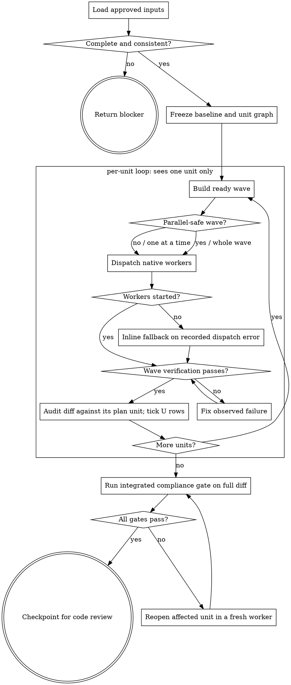

# Wayne Work

Execute one approved implementation plan to a verified, review-ready diff.

## Boundary

Own implementation, plan-unit tracking, test-as-you-go, integration, U status updates, and the final work handoff. Own two distinct scopes and never merge them: the per-unit conformance audit inside the implementation loop, and the single workflow-level compliance gate over the full diff. Do not redesign approved behavior, author a new plan/test matrix, change E status, commit, branch, push, open a PR, verify, ship, or perform code-quality review — that stays with `wayne-code-review`.

The plan, decision log, test matrix, repository instructions, and dirty baseline are source contracts. Read `../_shared/pipeline-id-contract.md`; consume IDs only from their defining structures and never renumber upstream artifacts.

## Flow

```dot
digraph work {
    rankdir=TB;
    A [label="Load approved inputs", shape=box];
    B [label="Complete and consistent?", shape=diamond];
    X [label="Return blocker", shape=doublecircle];
    C [label="Freeze baseline and unit graph", shape=box];

    subgraph cluster_unit {
        label="per-unit loop: sees one unit only";
        D [label="Build ready wave", shape=box];
        E [label="Parallel-safe wave?", shape=diamond];
        R [label="Dispatch native workers", shape=box];
        P [label="Workers started?", shape=diamond];
        F [label="Inline fallback on recorded dispatch error", shape=box];
        G [label="Wave verification passes?", shape=diamond];
        T [label="Fix observed failure", shape=box];
        H [label="Audit diff against its plan unit; tick U rows", shape=box];
        I [label="More units?", shape=diamond];
    }

    J [label="Run integrated compliance gate on full diff", shape=box];
    K [label="All gates pass?", shape=diamond];
    M [label="Reopen affected unit in a fresh worker", shape=box];
    L [label="Checkpoint for code review", shape=doublecircle];

    A -> B;
    B -> X [label="no"];
    B -> C [label="yes"];
    C -> D;
    D -> E;
    E -> R [label="yes / whole wave"];
    E -> R [label="no / one at a time"];
    R -> P;
    P -> G [label="yes"];
    P -> F [label="no"];
    F -> G;
    G -> T [label="no"];
    T -> G;
    G -> H [label="yes"];
    H -> I;
    I -> D [label="yes"];
    I -> J [label="no"];
    J -> K;
    K -> M [label="no"];
    M -> J;
    K -> L [label="yes"];
}
```

## Process

Every step is labeled with its scope, and the two scopes never merge. A `[per-unit]` step runs once per unit and is given only that unit's contract and its own diff. A `[whole-workflow]` step runs once for the run and is the only place the complete spec, decision log, plan, and full diff are read together. A per-unit step never stands in for a whole-workflow gate, and a whole-workflow concern is never audited inside the loop.

| Scope | Steps | Runs | Reads | Compliance agent |
| --- | --- | --- | --- | --- |
| `[whole-workflow]` setup | A, C | once | all source contracts | no |
| `[per-unit]` loop | D, R, F, G, H | once per unit | that unit's contract, its own diff, its verification command | no |
| `[whole-workflow]` gate | J, L | once per full diff | complete spec, decision log, plan, all units, full diff | yes — one fresh read-only agent |

### A. [whole-workflow] Load and validate inputs

Read repository instructions first, then the active plan, decision log, test matrix, and referenced spec completely. Validate before editing:

- plan status is approved and no other active plan conflicts;
- each implementation unit has goal, dependencies, consumes/produces, files, approach/design, patterns, test scenarios, U/E ownership, and verification;
- plan-owned U rows and authoritative E rows at the carried run-scoped test matrix path both exist once; the plan's E snapshot matches that matrix;
- unit file writes fit repository and plan scope boundaries;
- no unresolved decision changes the implementation shape.

Assign every `Deferred to Implementation` entry to one owning unit before dispatch. Resolve only mechanical questions whose answer is directly observable in the repository or runtime, and record the evidence in Work state. If an answer changes behavior or any approved boundary, treat it as a Plan gap and follow the user/Plan revision path below.

Do not invent a missing row, choose precedence between conflicting sources, or partially implement around a protected file. If implementation requires a behavior, scope, ownership, failure, compatibility, migration, or public-interface choice not covered by the approved sources, stop and ask the user. Return the answer to Plan for revision and re-approval; never implement it directly or choose a default. Return the task's blocker contract. Preserve the blocker reason, affected artifacts, owner, and user-facing explanation. Treat any shared layout as a communication convention, not a semantic grammar. Only an explicit caller requirement can make exact bytes or line count normative.

### C. [whole-workflow] Freeze baseline and task graph

Capture starting HEAD, branch, status, existing dirty paths, and source artifacts. Do not create a branch or commit. Convert plan units into a dependency graph and track status with any runtime task mechanism; no provider-specific task/team tool is required.

For each unit, extract its full text, relevant decisions, dependencies, consumes/produces, and exact write set. Assign every path one owner. Matrix, checkpoint, shared integration files, scope state, and full verification stay main-owned; remove them from worker write sets.

Build dependency waves and dispatch every unit to a native subagent worker; subagent execution is the default path, not an optimization. When at least two ready units have no producer/consumer dependency and disjoint write sets, dispatch the whole wave concurrently before awaiting one result. When a dependency or shared path prevents parallelism, dispatch one fresh worker at a time and record that specific edge or path — a serial wave is still dispatched, never inlined. Count a wave as started only when the tool returns observable worker handles or results. On an unavailable tool or dispatch error, quote the exact tool error in both handoff and final result and take the inline fallback in F; never claim parallelism. The main agent implements nothing and remains owner of scope, actual-diff audit, integration, U status, and completion.

### D. [per-unit] Build and start one ready wave

Read each ready unit's real source and existing tests before dispatch. Confirm its inputs/outputs and named consumers. If code contradicts a plan assumption, stop and return the conflict to planning.

Build each worker's packet from exactly what H will audit: one fixed unit ID; full goal, decisions, approach, named interfaces, and consumes/produces; exact allowed paths; the unit's test scenarios; and the unit's verification command. Hand the packet together with [the worker contract](references/implementation-worker.md) verbatim — that file is the worker-facing text and owns its authority boundary, prohibitions, evidence duty, and return format, including the four statuses. Do not paraphrase it into the dispatch prompt, and do not let a worker rediscover the plan.

What the main agent does with each returned status:

- `DONE` enters verification.
- `DONE_WITH_CONCERNS` enters verification only when the concern is observational; correctness, scope, or ownership concerns block the unit.
- `NEEDS_CONTEXT` may receive existing repository/plan context and retry the same unit; it never receives a new decision invented by the main agent.
- `BLOCKED` is never retried unchanged. A source or Plan gap follows A and asks the user; a mechanical implementation obstacle may be decomposed without changing the unit's behavior or write boundary.

### R. [per-unit] Establish RED when required

Follow the unit execution note. For test-first work, run the exact unit command before implementation and preserve the non-zero result. RED must fail for missing behavior, not environment or tooling. Diagnose unexpected failures before coding. Never edit, delete, skip, or weaken a locked test to manufacture GREEN.

### F. [per-unit] Implement the unit

Change only plan-owned files and implement the named interfaces exactly. Preserve decision semantics, state ownership, error behavior, and existing repository patterns. Add tests only when the plan assigns test authorship to this stage; when tests are locked, treat them as immutable acceptance inputs.

Do not add adjacent cleanup, defensive behavior, fallback paths, generalized abstractions, or compatibility work merely because they seem useful. When such a change is necessary for correctness, the Plan is incomplete: stop and follow the boundary process instead of expanding the unit.

Inline execution is a fallback, not a choice: use it only after an observable native-dispatch failure whose exact tool error is recorded and quoted. Every implementer reports actual paths changed and commands run; no implementer commits or updates matrix/E ownership independently.

### G. [per-unit] Verify and repair from evidence

Run the unit's exact verification command. If it fails, connect the failure to the smallest source correction, apply it, and rerun the same command. Do not broaden scope, add speculative fallback, or swap in an easier check. A provider/tool failure is not a behavioral test result.

### H. [per-unit] Audit the diff against its plan unit and update U status

For each completed unit, the main agent inspects the actual diff rather than trusting worker summaries, against only the corresponding approved plan unit. Confirm the diff implements that unit's goal, named interfaces, consumes/produces, allowed write set, test scenarios, and verification command, and that it changes nothing the unit does not own. Judge by reading the diff against the unit text; CLI output, regex, keywords, or validator status cannot substitute. Do not dispatch any agent here and do not broaden this audit past the unit: not the complete spec, not the decision log, not other units. A decision is audited here only when the unit contract already carries it; everything else is J's.

Any change the unit does not cover fails the unit and returns to Plan/user instead of being normalized into the diff. Separately from that audit, run the plan-defined wave/integration checks and reject cross-owner writes or overlapping edits; the main agent performs shared integration only after all producing workers finish, and does not start a dependent wave while this barrier fails. Only after each real unit test passes, change its plan-owned U rows from `☐` to `☑`. Never edit U scenario text, the plan's E snapshot, or any authoritative E row/status `⬜`.

### J. [whole-workflow] Run the integrated compliance gate

After dependency waves finish, run the plan's full verification and lint commands. Then dispatch one fresh read-only spec-compliance agent with the complete decision log, spec, plan, all units, and the full diff. It must flag missing, changed, and extra behavior or files by contextual reading; CLI output, regex, keywords, headings, or validator status cannot substitute. This gate judges spec, decision, plan, scope, and cross-unit conformance — not general code quality, which stays with `wayne-code-review`.

The receipt covers only the diff the gate was given. An implementation finding reopens the affected unit in a fresh worker under the same unit boundary; a plan or spec gap returns to Plan/user. Any correction invalidates the receipt: rerun the gate on the corrected full diff before continuing. Then audit:

- every unit is DONE with its produces consumed where planned;
- all requirements and decisions have implementation evidence;
- the diff contains only plan-owned source, authorized U status changes, and work state; starting Git status, agent write history, and final diff show no unrelated or locked-input mutation;
- every U row is `☑`, every E row remains `⬜`;
- no incomplete implementation, staged file, commit, branch, or downstream action was introduced; judge completeness from code, tests, and plan obligations rather than a substring scan.

Do not claim completion while any command, unit, U row, decision, or scope gate is unresolved.

### L. [whole-workflow] Handoff to wayne-code-review

Run this once per run, after J passes; it is never a per-unit step. Write one packet under `.wayne/checkpoints/` through `wayne-checkpoint` return-only mode or a supplied canonical contract. Verify the file exists and surface its path; without either mechanism, return the shared blocker information. Include plan/matrix paths, units, passing commands, changed paths, preserved scope, residual risks, and `next_agent: wayne-code-review`; final output repeats that literal but never invokes it.

## Red lines

- No implementation with incomplete/conflicting source contracts.
- No inline implementation without an observable, quoted native-dispatch error.
- No provider-specific task API, shell-process substitute, silent serial fallback, or claimed parallel success after a tool error.
- No compliance agent inside the per-unit loop, no per-unit audit substituted for the whole-workflow gate, and no gate receipt carried over a corrected diff.
- No test weakening, hidden substitute command, unchecked U row, or changed E row.
- No completion claim without full verification and actual scope-diff proof.
- No commit, branch, stage, push, code-quality review, verify, ship, or auto-advance.
